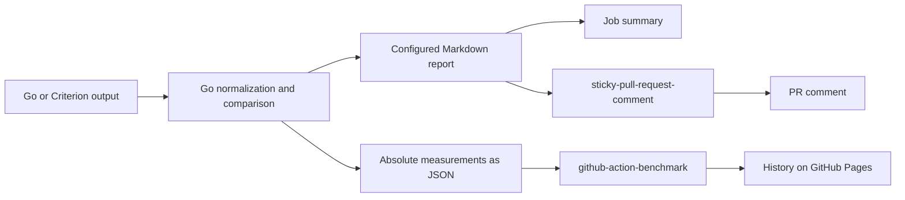

# Benchmark Report

Benchmark Report provides a composite GitHub Action that publishes a prepared Markdown report through `sticky-pull-request-comment`. The Go CLI normalizes and compares Go benchmark text and Rust Criterion logs, renders configurable Markdown/JSON, verifies offline replay bundles, and exports absolute measurements for benchmark history. The generator action is implemented; its first binary release is not available yet.

See [output examples](docs/output-examples.md) for Go and Criterion reports, a compact report, allocation and throughput tables, and history JSON.

## Why build this

The initial consumers are `sshaplygin/go-socket.io` and `sshaplygin/ytsaurus-rs`. Both compare the PR base and head on the same runner, but maintain separate formatting and publication code. The required presentation is illustrated by the [Go benchmark comment in PR 15](https://github.com/sshaplygin/go-socket.io/pull/15#issuecomment-5966539113): package tables, timing estimates, percentage changes, advisory signals, and expandable benchstat results.

Existing tools cover parts of this workflow:

| Existing solution | Useful capability | Gap for this project |
| --- | --- | --- |
| [github-action-benchmark](https://github.com/benchmark-action/github-action-benchmark) | Benchmark history, GitHub Pages charts, configurable alerts, Go and Rust input | Its comment layout is implemented in code. It has no report template input or standalone file-to-report CLI. Its normal comparison uses a stored previous run; the consumers require an explicit base/head pair. |
| [gobenchdata](https://github.com/bobheadxi/gobenchdata) | Go CLI, Go benchmark processing, history and visualization | Its documented input is Go benchmark output; it does not provide the required shared Go/Criterion report interface. |
| Current repository scripts | Existing package tables, Criterion aggregation, comment updates | Repository-specific assumptions and separate implementations must be maintained twice. |

These gaps justify a shared parser, comparison model, and renderer. Comment publication is delegated to [sticky-pull-request-comment](https://github.com/marocchino/sticky-pull-request-comment); historical storage and charts remain with github-action-benchmark. The language of an existing action is not a reason to replace it.

The assessment of `github-action-benchmark` is based on its [action inputs](https://github.com/benchmark-action/github-action-benchmark/blob/master/action.yml), [Markdown renderer](https://github.com/benchmark-action/github-action-benchmark/blob/master/src/write.ts), and [package definition](https://github.com/benchmark-action/github-action-benchmark/blob/master/package.json). The tested history integration and dependency pin are recorded in [History](docs/history.md).

## Recommended use



On a pull request, the consumer workflow runs both revisions with one toolchain on the same runner for each suite. The Go generator creates the report; the existing composite action writes the summary and delegates comment updates. Fork PRs receive a job summary, with artifacts uploaded by the caller.

On a push to the primary branch, the workflow measures the accepted commit and exports absolute measurements to `github-action-benchmark`. That action owns historical storage and charts. Its comments, summaries, and failure alerts are disabled in this integration so that report policy has one owner. History publication is optional.

Each repository retains its build commands, toolchain selection, change detection, suite matrix, and caching. The shared action consumes completed measurements. The Go-specific change detector in `go-socket.io` stays in that repository.

## Publish an existing report

After generating or downloading `benchmark-report.md`, call the root action in a publishing job with `pull-requests: write`. Replace the revision placeholder with a reviewed commit containing the action.

```yaml
- uses: sshaplygin/benchmark-report@<reviewed-commit-sha>
  with:
    report-path: benchmark-report.md
    header: benchmark-report-go
```

This entry point needs no Go or Python installation. It accepts existing reports from either repository. It supports Linux and macOS runners with Bash and the Node 24 action runtime required by the pinned dependency. See [publication configuration](docs/publication.md) for inputs, permissions, fork behavior, and migration of old comments.

## Local normalization

Build from source with Go 1.25 or later. The captured manifests provide runnable examples with recorded revisions, toolchains, suite commands, and input paths:

```sh
go build -o bin/benchreport ./cmd/benchreport
mkdir -p out
./bin/benchreport normalize --parser go \
  --manifest testdata/captured/go-pr15/base-manifest.json --out out/base.json
./bin/benchreport normalize --parser criterion \
  --manifest testdata/captured/criterion-four-suites/head-manifest.json --out out/criterion.json
```

Normalization preserves source checksums, Go samples, and Criterion estimate bounds. It reads recorded logs without running benchmarks or contacting GitHub. See [manifest contracts](docs/contracts.md#metadata-and-files) for preparing your own inputs and [fixture evidence](docs/fixtures.md) for the captured runs.

## Local comparison

After the normalization example, prepare the matching head and compare it with the saved base:

```sh
./bin/benchreport normalize --parser go \
  --manifest testdata/captured/go-pr15/head-manifest.json --out out/head.json
./bin/benchreport compare --base out/base.json --head out/head.json --out out/comparison.json
./bin/benchreport config validate --config examples/benchmark-report.json
```

The default comparison needs no statistical tool or raw logs after normalization. To request benchstat, use the example configuration and install the [pinned tool](docs/contracts.md#tools-and-boundaries) beside the CLI, or select it with `--benchstat-path`. Statistical analysis verifies the saved raw input checksums before running.

An enabled regression gate returns exit code 2 after writing the complete comparison. Report filters do not change that decision. Environment differences fail unless explicitly allowed with `--allow-environment-mismatch`; an allowed difference is recorded in the comparison.

## Render and reproduce a report

```sh
./bin/benchreport render --input out/comparison.json --output-dir out/report
./bin/benchreport render --input out/report/replay-inputs/comparison.json \
  --config out/report/replay-inputs/configuration.json \
  --reproduction out/report/reproduction.json --output-dir out/replayed
```

The first command writes the enabled reports, effective configuration, comparison snapshot, and `reproduction.json`. The second verifies the bundle and regenerates the same report bytes. Input paths and checksums are checked before replay; neither command needs GitHub credentials or a network connection.

Use `--config FILE` to select metrics, columns, grouping, filters, sections, and output filenames. See [configuration](docs/configuration.md) for the complete contract. A standalone render bundle reproduces presentation from its saved comparison. Use `report` below to retain the inputs needed to verify normalization and calculation too.

## Generate and verify a full bundle

```sh
./bin/benchreport report --parser go \
  --base-manifest testdata/captured/go-pr15/base-manifest.json \
  --head-manifest testdata/captured/go-pr15/head-manifest.json --output-dir out/bundle
./bin/benchreport replay --reproduction out/bundle/reproduction.json --output-dir out/verified
```

The full bundle includes raw logs, rebased manifests, normalized runs, configuration, calculations, and rendered reports. Replay verifies its inventory before repeating normalization and comparison offline. Both commands require a fresh output directory. For CI inputs, outputs, installation, and publication order, see the [generator action](docs/report-action.md) and [PR workflow example](examples/pull-request.yml).

## Export benchmark history

Export the normalized head run with history enabled in the configuration:

```sh
./bin/benchreport export --input out/head.json \
  --config examples/benchmark-report.json --output-dir out/history
```

The command writes nonempty direction groups and prints their paths as JSON. History filters are independent of report filters. Export runs locally without credentials; the caller passes its files to the pinned external action on primary-branch pushes. See [History](docs/history.md) for the workflow, Pages prerequisites, and integration checks.

Reproducing a saved report does not promise identical timings from a new benchmark run.

## Development checks

Run `go test ./...` and `golangci-lint run ./...` from the repository root. Use the golangci-lint version pinned in [CI](.github/workflows/ci.yml); [.golangci.yml](.golangci.yml) defines the shared local and CI checks.

## Documentation

| Document | Owns |
| --- | --- |
| [Architecture](docs/architecture.md) | Data contracts, CLI boundaries, comparison semantics, CI integration, and trust boundaries |
| [Version 1 contracts](docs/contracts.md) | JSON schemas, exact value representation, identity encoding, and command specifications |
| [Fixtures](docs/fixtures.md) | Captured log provenance and independently calculated acceptance cases |
| [Configuration](docs/configuration.md) | User controls, defaults, validation, selection rules, and output behavior |
| [Output examples](docs/output-examples.md) | Expected rendered results and the configuration choices that produce them |
| [Generator action](docs/report-action.md) | Action inputs/outputs, binary installation, full artifact upload, and PR workflow |
| [History](docs/history.md) | Tested external action pin, primary-branch workflow, Pages prerequisites, and integration checks |
| [Publication](docs/publication.md) | Implemented action inputs, dependency pin, event handling, permissions, and comment migration |
| [Consumer migrations](docs/migrations.md) | Proposed consumer patches, rollout prerequisites, and links to verification and rollback |
| [Compatibility](docs/compatibility.md) | Tested input formats, artifact versions, native platforms, and replay coverage |
| [Implementation plan](docs/implementation-plan.md) | Ordered delivery stages, definitions of done, reviewer acceptance criteria, and release evidence |
| [Example configuration](examples/benchmark-report.json) | A complete consumer configuration using the version 1 interface |

Requirements are defined in their owning document. The implementation plan links to those contracts instead of redefining them. Interface changes must update the owning document and its examples together.

## License

Benchmark Report is licensed under the [Mozilla Public License 2.0](LICENSE). Bundled dependencies retain their own licenses and notices, included in release archives.
