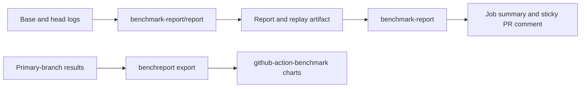

# Benchmark Report

Compare Go benchmarks and Rust Criterion results, publish a configurable PR report, and reproduce it locally from archived inputs. The Go CLI generates Markdown and JSON; the GitHub Actions install the CLI and publish reports through [sticky-pull-request-comment](https://github.com/marocchino/sticky-pull-request-comment).

See [output examples](docs/output-examples.md) for rendered reports and configuration variants.

## Why this tool

[github-action-benchmark](https://github.com/benchmark-action/github-action-benchmark) provides historical comparisons and charts. Its tested version has [fixed Markdown rendering](https://github.com/benchmark-action/github-action-benchmark/blob/4322e5726e6334590d251fc4f92bec0efafc45dc/dist/src/write.js) and [no report-template input](https://github.com/benchmark-action/github-action-benchmark/blob/4322e5726e6334590d251fc4f92bec0efafc45dc/action.yml).

Benchmark Report handles explicit base/head inputs, configurable tables shared by Go and Criterion, and offline reproduction of the calculations and report. Comment updates use sticky-pull-request-comment. Optional history export feeds github-action-benchmark for storage and charts.

## Recommended workflow

Run base and head with the same toolchain on the same runner for each suite. Pass their completed logs and manifests to the generator, upload its full bundle, then publish from a separate job with PR write permission.



Benchmark commands, caching, change detection, and suite selection belong to the caller. History uses primary-branch measurements and a [separate publishing workflow](docs/history.md).

## Used by

These workflows run Benchmark Report v0.1.0, pinned to its release commit:

| Repository | Workflow and configuration | Generated report |
| --- | --- | --- |
| go-socket.io | [Workflow](https://github.com/sshaplygin/go-socket.io/blob/master/.github/workflows/benchmarks.yml), [configuration](https://github.com/sshaplygin/go-socket.io/blob/master/.github/benchmarks/benchmark-report.json) | [Package tables and benchstat](https://github.com/sshaplygin/go-socket.io/pull/17#issuecomment-6026132160) |
| ytsaurus-rs | [Workflow](https://github.com/sshaplygin/ytsaurus-rs/blob/main/.github/workflows/benchmarks.yml), [configuration](https://github.com/sshaplygin/ytsaurus-rs/blob/main/.github/benchmark-report.json) | [Four Criterion suites](https://github.com/sshaplygin/ytsaurus-rs/pull/93#issuecomment-6026770870) |

The [generator action](docs/report-action.md) documents inputs, outputs, and installation. The root [publication action](docs/publication.md) also accepts reports generated by other tools:

```yaml
- uses: sshaplygin/benchmark-report@f71129f2bebcf57f953b27607b7d8bb8c23afae9 # v0.1.0
  with:
    report-path: benchmark-report.md
    header: benchmark-report-go
```

## Run locally

Download a binary from [Releases](https://github.com/sshaplygin/benchmark-report/releases), or build with Go 1.25 or later. This example uses the captured Go inputs included in the repository:

```sh
go build -o bin/benchreport ./cmd/benchreport
./bin/benchreport report --parser go \
  --base-manifest testdata/captured/go-pr15/base-manifest.json \
  --head-manifest testdata/captured/go-pr15/head-manifest.json --output-dir out/bundle
./bin/benchreport replay --reproduction out/bundle/reproduction.json --output-dir out/verified
```

Both output directories must be absent or empty. Replay checks the archived inputs and regenerates the calculations and report without running benchmarks or contacting GitHub. Use the generator version recorded in the bundle.

Add `--config FILE` to choose metrics, columns, grouping, filters, output formats, and regression policy. See [Configuration](docs/configuration.md) for defaults and [CLI contracts](docs/contracts.md#cli-contract) for individual normalize, compare, render, and export commands. Go statistical details require the pinned benchstat binary included in release archives.

## Development

Run `go test ./...` and `golangci-lint run ./...`. Use the lint version pinned in [CI](.github/workflows/ci.yml). The [history integration test](docs/history.md#local-verification) requires a checkout of its pinned upstream action. Release and consumer verification results are in the [acceptance record](https://github.com/sshaplygin/benchmark-report/pull/1).

## Reference

| Document | Contents |
| --- | --- |
| [Architecture](docs/architecture.md) | Adapter boundaries, normalization, and comparison rules |
| [Contracts](docs/contracts.md) | JSON schemas, exact values, CLI commands, and replay layout |
| [Configuration](docs/configuration.md) | Options, defaults, and selection rules |
| [Report action](docs/report-action.md) | Generation inputs/outputs and binary installation |
| [Publication](docs/publication.md) | Permissions, comment identity, and size limits |
| [History](docs/history.md) | Export integration and GitHub Pages setup |
| [Compatibility](docs/compatibility.md) | Supported input formats and platforms |
| [Fixtures](docs/fixtures.md) | Captured input provenance and expected results |

## License

[Mozilla Public License 2.0](LICENSE). Release archives include dependency licenses and notices.
