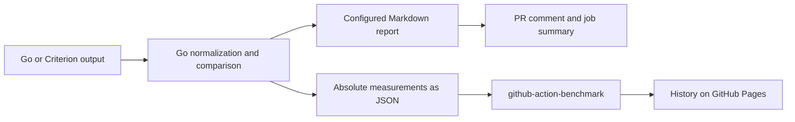

# Benchmark Report

Benchmark Report is a planned Go CLI and GitHub Action for comparing Go and Criterion benchmark runs, producing configurable reports, and reproducing CI reports locally. This directory contains the implementation specification. No CLI, action, or release exists yet. Command examples describe the intended interface.

See [output examples](docs/output-examples.md) for Go and Criterion reports, a compact report, allocation and throughput tables, and history JSON.

## Why build this

The initial consumers are `sshaplygin/go-socket.io` and `sshaplygin/ytsaurus-rs`. Both compare the PR base and head on the same runner, but maintain separate formatting and publication code. The required presentation is illustrated by the [Go benchmark comment in PR 15](https://github.com/sshaplygin/go-socket.io/pull/15#issuecomment-5966539113): package tables, timing estimates, percentage changes, advisory signals, and expandable benchstat results.

Existing tools cover parts of this workflow:

| Existing solution | Useful capability | Gap for this project |
| --- | --- | --- |
| [github-action-benchmark](https://github.com/benchmark-action/github-action-benchmark) | Benchmark history, GitHub Pages charts, configurable alerts, Go and Rust input | Its comment layout is implemented in code. It has no report template input or standalone file-to-report CLI. Its normal comparison uses a stored previous run; the consumers require an explicit base/head pair. |
| [gobenchdata](https://github.com/bobheadxi/gobenchdata) | Go CLI, Go benchmark processing, history and visualization | Its documented input is Go benchmark output; it does not provide the required shared Go/Criterion report interface. |
| Current repository scripts | Existing package tables, Criterion aggregation, comment updates | Repository-specific assumptions and separate implementations must be maintained twice. |

These gaps justify a shared parser, comparison model, renderer, and publisher. They do not justify rebuilding a chart dashboard. The language of an existing action is not a reason to replace it.

The assessment of `github-action-benchmark` is based on its [action inputs](https://github.com/benchmark-action/github-action-benchmark/blob/master/action.yml), [Markdown renderer](https://github.com/benchmark-action/github-action-benchmark/blob/master/src/write.ts), and [package definition](https://github.com/benchmark-action/github-action-benchmark/blob/master/package.json), inspected on 2026-10-03. Recheck these interfaces before implementing the integration.

## Recommended use



On a pull request, the consumer workflow runs both revisions with one toolchain on the same runner for each suite. Benchmark Report creates the report and updates a single comment. Fork PRs receive a job summary and downloadable artifacts by default.

On a push to the primary branch, the workflow measures the accepted commit and exports absolute measurements to `github-action-benchmark`. That action owns historical storage and charts. Its comments, summaries, and failure alerts are disabled in this integration so that report policy has one owner. History publication is optional.

Each repository retains its build commands, toolchain selection, change detection, suite matrix, and caching. The shared action consumes completed measurements. The Go-specific change detector in `go-socket.io` stays in that repository.

## Local use

The planned CLI separates computation from publication:

```sh
benchreport normalize --parser go --manifest base-inputs.json --out base.json
benchreport normalize --parser go --manifest head-inputs.json --out head.json
benchreport compare --base base.json --head head.json \
  --config benchmark-report.json --out comparison.json
benchreport render --input comparison.json \
  --config benchmark-report.json --output-dir out
benchreport export --input head.json \
  --config benchmark-report.json --output-dir out
```

Use `--parser criterion` for Criterion logs. These commands do not require GitHub credentials. CI artifacts record the inputs, metadata, effective configuration, tool versions, and results needed to reproduce a report. Reproducing a report does not promise identical timings from a new benchmark run.

## Documentation

| Document | Owns |
| --- | --- |
| [Architecture](docs/architecture.md) | Data contracts, CLI boundaries, comparison semantics, CI integration, and trust boundaries |
| [Configuration](docs/configuration.md) | User controls, defaults, validation, selection rules, and output behavior |
| [Output examples](docs/output-examples.md) | Expected rendered results and the configuration choices that produce them |
| [Implementation plan](docs/implementation-plan.md) | Ordered delivery stages, definitions of done, reviewer acceptance criteria, and release evidence |
| [Example configuration](examples/benchmark-report.json) | A complete consumer configuration using the proposed interface |

Requirements are defined in their owning document. The implementation plan links to those contracts instead of redefining them. Changes to the proposed interface must update the owning document and its examples together.
