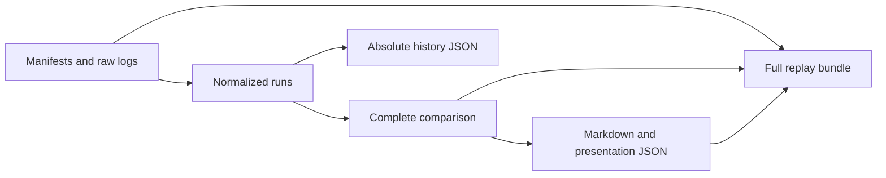

# Architecture

`benchreport` turns completed benchmark logs into comparisons, reports, history exports, and offline replay bundles. Consumers run their benchmarks; the CLI does not execute them or call GitHub APIs.

## Boundaries

The Go CLI supports the platforms and formats listed in [Compatibility](compatibility.md). The [report action](report-action.md) installs its mapped release binary. The separate [publication action](publication.md) accepts Markdown and delegates comment operations to sticky-pull-request-comment.

| Packages | Responsibility |
| --- | --- |
| `internal/model`, `internal/contracts`, `internal/decimal` | Typed documents, validation, identity, and exact arithmetic |
| `internal/input`, `internal/adapters/gobench`, `internal/adapters/criterion` | Input loading, source parsing, and normalization |
| `internal/config`, `internal/compare`, `internal/statistics` | Effective configuration, comparisons, and optional pinned benchstat |
| `internal/render`, `internal/history` | Presentation and absolute history measurements |
| `internal/output`, `internal/reproduction`, `internal/pipeline` | Transactional files, verified bundles, and orchestration |

`cmd/benchreport` connects these packages. Domain packages have no GitHub environment or API dependencies. Parser implementations are not imported by comparison, rendering, or export.

## Adapter boundary

An adapter translates source syntax into the normalized-run model. It owns metric mapping, estimator identification, and source diagnostics. The shared comparison and presentation layers consume that model. Source-specific statistical analysis is optional; benchstat is not required by the Criterion adapter.

Go and Criterion text are supported. The following formats are not implemented:

- [Google Benchmark JSON](https://google.github.io/benchmark/user_guide.html#output-formats), with CPU time and elapsed time as distinct metrics.
- [BenchmarkDotNet JSON exports](https://benchmarkdotnet.org/articles/configs/exporters.html), retaining runtime, job, and parameter identity.
- [Tinybench](https://github.com/tinylibs/tinybench), requiring a defined export format and supported version range.
- A public `benchreport-json` format for custom producers. The internal normalized-run document is not a stable public ingestion API.

Each additional adapter requires a format mapping, compatibility policy, fixtures, and acceptance tests. Additional metrics or framework semantics may require a new schema version. There is no dynamic plugin loader or public extension API.

## Data contracts

[Contracts](contracts.md) defines document schemas, identities, canonical units, exact values, and file references. [Configuration](configuration.md) defines policy and selection. A display label or filter never changes measurement identity, calculations, or history values.

## Normalization

The Go adapter reads `go test -bench -benchmem` text, including package boundaries, sub-benchmarks, CPU suffixes, and repetitions. It supports time, bytes per operation, allocations per operation, and throughput. Samples are retained. The estimate is their median; an even count uses the arithmetic mean of the middle pair.

The Criterion adapter reads inline and separate-line names, timing intervals in `ns`, `us`, `µs`, `ms`, and `s`, and interleaved progress. It retains the point estimate and bounds in nanoseconds without inventing samples. Throughput annotations and percentage-change lines are ancillary output, not absolute timing measurements. Criterion throughput and native JSON input are unsupported.

Both adapters require finite, nonnegative measurements. Malformed supported results and unknown Go metric units fail with a source diagnostic; known progress and unrelated lines are ignored. Missing, empty, or incomplete suites fail normalization. An added or removed benchmark between complete runs remains a valid comparison row.

## Comparison

Comparison uses the union of measurement identities and requires compatible metric definitions. Base/head expected-suite sets and recorded environments must match under the [metadata contract](contracts.md#metadata-and-files). The explicit environment override records differences and does not override metric definitions.

The percentage is `(head / base - 1) * 100`. Two zero estimates produce zero; a zero base with positive head produces `zero_baseline` and no finite percentage. Added and removed measurements also have no percentage. Incompatible definitions fail rather than disappearing from the comparison.

Advisory classification uses the percentage rounded to the configured precision, with ties away from zero and negative zero normalized. For lower-is-better metrics, an increase at the regression boundary is a regression and a decrease at the improvement boundary is an improvement. Higher-is-better metrics reverse these directions. Other comparable rows are `below_threshold`.

The optional gate evaluates all comparable input measurements, regardless of report or history filters. Advisory thresholds do not assert statistical significance. Optional Go benchstat evidence is stored separately; Criterion comparisons use recorded point estimates without claiming statistical significance between runs.

## CLI

The [CLI contract](contracts.md#cli-contract) specifies flags, outputs, exit codes, and policy checks. Output order and formatting are deterministic. Recorded revisions and tool metadata appear in reports; current timestamps do not. Identical inputs, configuration, and generator version reproduce the same report bytes on supported platforms, not identical timings from a new benchmark run.

## GitHub integration

Consumers keep benchmark execution and publication in separate jobs. Computation uses read-only repository permissions; the publisher executes no PR code or downloaded program. Fork and Dependabot runs retain summaries and artifacts without posting comments. [Publication](publication.md) owns permissions, comment behavior, sizing, and the limitation on rerunning old workflows.

## History integration

History exports absolute estimates from accepted primary-branch runs, using the same estimator as local reports. Selection is independent of presentation. [History](history.md) owns action settings, profile separation, permissions, and serialized writes; [Contracts](contracts.md#history-serialization-and-outputs) owns the exported format and numeric compatibility.

## Reproduction artifacts

A presentation bundle reproduces rendering from a saved comparison and configuration. A full bundle also retains raw inputs and verifies normalization and calculation. [Contracts](contracts.md#reproduction-layout) defines inventories, path protection, tool identity, and replay checks. Replay does not fetch missing baselines, change revisions, download tools, or execute recorded command strings.
